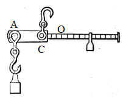

# Physics

## Motion

In an $O-xyz$ coordinate system the position vector $\vec r$ is defined as:

$$
\vec r(t) = x(t)\hat i + y(t)\hat j + z(t)\hat k
$$

Its magnitude is:

$$
r(t) = \sqrt{x^2 + y^2 + z^2}
$$

In polar coordinates, it is usually defined in terms of $r$ and $\theta$.

The displacement vector $\Delta\vec s$ is defined as:

$$
\Delta\vec s = \vec r(t + \Delta t) - \vec r(t)
$$

The average velocity is:

$$
\bar{\vec v} = \frac{\Delta\vec s}{\Delta t}
$$

The instantaneous velocity and acceleration is:

$$
\vec v = \lim_{\Delta t \to 0} \frac{\Delta\vec s}{\Delta t} = \frac{d\vec s}{dt} \\
\vec a = \frac{d\vec v}{dt}
$$

Formulas for constant acceleration motion on a straight line:

$$
\begin{align*}
  v & = v_0 + at \\
  S & = v_0t + \frac 1 2 at^2 \\
  v^2 - v_0^2 & = 2aS \\
  S & = \frac 1 2 (v_0 + v)t
\end{align*}
$$

```{admonition} Strategy: Maximum/minimum values
1. write down the expression for the variable
2. simplify the expression so that it contains one and **only one** **independent** variable
3. mathematically determine the extremum
```

```{admonition} Alternative strategy: Maximum/minimum values
This is best suited for geometric problems (instead of ones that requires tons of calculation).
1. try to determine the position of extremum by *intuition* (sort of obscure)
2. rigorously prove your *intuition*
3. solve the problem
```

General motion in polar coordinates:

$$
\mathbf{r} = (r\cos\theta, r\sin\theta) \\
\mathbf{\dot r} = (
  \dot r\cos\theta - r\sin\theta\dot\theta,
  \dot r\sin\theta + r\cos\theta\dot\theta
) = \dot r\hat r + r\dot\theta\hat\theta \\
\mathbf{\ddot r} = (\ddot r - r\dot\theta^2)\hat r + (2\dot r\dot\theta + r\ddot\theta)\hat\theta 
$$

### Projectile motion

```{admonition} Model: Falling objects with initial upward velocity
$$
\left\{
\begin{array}{l}
    x = v_0 \cos\theta\,t \\
    y = v_0 \sin\theta\,t - \frac{1}{2}gt^2
\end{array}
\right.
$$

$$
\left\{
\begin{array}{l}
    v_x = v_0\cos\theta \\
    v_y = v_0\sin\theta - gt
\end{array}
\right.
$$
```

```{admonition} Model: Objects falling onto a tilted surface
1. create a coordinate system with the surface as the x(y)-axis
2. identify the initial conditions (velocity, position and acceleration)
3. plug in the equations and solve the problem
```

### Circular and spiral motion

Rigid bodies:

- translational motion
- rotational motion
- combination motion

Angular velocity

$$
\omega = \lim_{\Delta t \to 0} \frac{\Delta \theta}{\Delta t} = \frac{d\theta}{dt}
$$

Angular acceleration

$$
\beta = \frac{d\omega}{dt}
$$


Constant-angular-acceleration rotational motion:

$$
\begin{align*}
  \omega & = \omega_0 + \beta t \\
  \theta & = \omega_0 t + \frac{1}{2}\beta t^2 \\
  \omega^2 - \omega_0^2 & = 2\beta\theta \\
  \theta & = \frac{1}{2}(\omega_0 + \omega)t
\end{align*}
$$

The radius of curvature $\rho$:

$$
\rho = \left|\frac{(1 + y'^2)^{3/2}}{y''}\right|
$$

```{tip}
The acceleration of an object stays the same in different inertial reference frames.
```

````{tip}
Switching inertial reference frames is an excellent way to calculate acceleration.

```{admonition} Example
$$
a = \frac{v^2}{r}
$$

if the center of rotation is stationary in a particular reference frame
```
````

```{admonition} Strategy: Problems involving the angle between two vector quantities
Express the vector (for example, velocity or acceleration) by selecting a pair of basis vectors and then utilizing the [dot product](linear-algebra.md#dot-products-and-lengths):

$$
\cos\theta = \frac{\vec{u}\cdot\vec{v}}{\Vert\vec{u}\Vert\Vert\vec{v}\Vert}
$$

Or more specifically, when $\vec{u}\perp\vec{v}$,

$$
\vec{u}\cdot\vec{v} = 0
$$
```

```{note}
A reference frame can be rotating, in which case it is called a rotating reference frame. A
rotating reference frame is **not** an inertial reference frame.

If a **rotating object** seems to be **stationary** in a rotating reference frame, then it has the same
angular speed as the rotating frame itself, although the direction of $\omega$ (angular velocity)
is reversed.

$$
\omega_{object} = -\omega_{frame}
$$
```

## The balance of objects

### The balance of forces

Types of forces:

- gravitational force
- elastic force
- friction
- $\dots$

Springs:

$$
\vec{F} = -k\Delta\vec{x}
$$

where $k$ is the spring constant.

Multiple springs:

- series:
  
  $$
  \frac{1}{k} = \frac{1}{k_1} + \frac{1}{k_2} + \cdots
  $$
- parallel:
  
  $$
  k = k_1 + k_2 + \cdots
  $$

Friction angle:

let $\mu = \tan\varphi$, then

$$
\frac{f_{max}}{N} = \mu_{static} = \tan\varphi
$$

Generally, $f_{static} < f_{max}$. Therefore, 

$$
f_{static} < \mu_{static}N \\
\frac{f_{static}}{N} < \mu_{static} = \tan\varphi
$$

The angle $\alpha$ between the full reaction force $F$ and the normal line cannot be greater than the friction angle $\varphi$

$$
\alpha = \arctan\frac{f_{static}}{N} < \varphi
$$

```{attention}
When the solution to a problem can not be specified as a fixed value, solve for the range of values it lies in.
```

```{admonition} Strategy: Balancing objects influenced by friction
1. use "friction angles"
   
   $$
   \tan\varphi = \mu
   $$
   
2. use geometry and trigonometry to figure out the relationship between the angles
3. substitute $\mu$ back in and get the answer
```

```{admonition} Strategy: The fewer forces, the better
When a large object is in balance, try to find a segment of the object on which the fewest forces act.
In other words, restrict yourself to one or two forces.
```

Young's modulus

$$
E = \frac{\text{stress}}{\text{strain}} = \frac{F/A}{\Delta l/l}
$$

Shear modulus

$$
G = \frac{\text{shear stress}}{\text{shear strain}} = \frac{F/A}{\theta}
$$

### Moment and rotation

$$
\mathbf{M} = \mathbf{r}\times\mathbf{F}
$$

Condition for balance:

$$
\sum\mathbf{M} = \mathbf{0}
$$

Force couples:

$$
\tau = Fd
$$

where $\tau$ is the torque the couple has on the object and $d$ is the distance between the two forces.

---

The synthesis of parallel forces

Let $|AO|$ be the distance between $F$ (the combined force) and $F_1$, and $|BO|$ be the distance between $F$ and $F_2$, then

$$
\frac{|OA|}{|OB|} = \frac{F_2}{F_1}
$$

The magnitude of $F$ depends on whether $F_1$ and $F_2$ are in the same direction or not.

```{admonition} Model: An object with a hole in it
1. pretend that the hole doesn't exist
2. recreate the hole by putting a force in the opposite direction
```

```{tip}
If the direction of a force is unknown, suppose it is in a specific direction and determine whether the system
can stay in balance.

Alternatively, use a coordinate system, write down the force as a general vector $x\hat i + y\hat j + z\hat k$
and apply [linear algebra](linear-algebra.md#linear-algebra)
```

```{admonition} Model: Steelyard balance


(By An Elementary Treatise on Analytic Mechanics: With Numerous Examples By Edward A. (Edward Albert) Bowser, 1893., Public Domain, [Link](https://commons.wikimedia.org/w/index.php?curid=1319572))

Let $|AC| = d$, $|CO| = l_0$, and let $M$ be the moment the gravity of the whole balance has on the pivot $C$

Then if the mass of the weight is $m$, and the mass of the counterweight is $m_0$, we have

$$
M = m_0gl_0
$$

and

$$
mgd + M = m_0g(l_0 + \lambda m)
$$

where $\lambda$ is the ratio of the distance between $O$ and the counterweight and $m$.

Therefore,

$$
d = \lambda m_0
$$

This is the fundamental equation of steelyard balances.
```

```{tip}
A useful trigonometric identity (half angle formula for $\tan$):

$$
\tan\frac{x}{2} = \pm\sqrt{\frac{1 - \cos x}{1 + \cos x}} = \frac{\sin x}{1 + \cos x} = \frac{1 - \cos x}{\sin x} 
$$
```

```{important}
When the number of equations is smaller than the unknowns, the system is statically indeterminate.
Look for hidden details in the text.
```

```{tip}
Focal radii for ellipse

$$
\left(\frac{x}{a}\right)^2 + \left(\frac{y}{b}\right)^2 = 1
$$

where $a \ge b > 0$:

Let $F_1$ denote the left focus and $F_2$ denote the right focus, and let $P(m, n)$ be a point on the ellipse, then

$$
\begin{align*}
  |PF_1| & = a + em \\
  |PF_2| & = a - em
\end{align*}
$$

```

### Liquids in static equilibrium

```{important}
Bernoulli's principle:

$$
p + \frac{1}{2}\rho v^2 + \rho gz = const
$$
```

```{note}
Centrifugal potential energy:

$$
E = -\int_0^xm\omega^2x\,dx = -\frac{1}{2}m\omega^2x^2
$$
```

## Newton's laws

- first: inertia
- second: $F = ma$
- third: action and reaction

```{note}
Newton's laws only apply under macroscopic, low-speed conditions.
```

Acceleration is the bridge between force and motion.

```{admonition} Strategy: How to find acceleration
1. relative motion
   
   $$
   a_{abs} = a_{sys} + a_{rel}
   $$
2. [L'Hospital's Rule](calculus.md#applications-of-differentiation)
   
   $$
   \lim_{t \to 0}\frac{s_1(t)}{s_2(t)} = \lim_{t \to 0}\frac{v_1(t)}{v_2(t)} = \lim_{t \to 0}\frac{a_1(t)}{a_2(t)}
   $$
   
   provided that when $t \to 0$, both $v_1$ and $v_2$ $\to 0$.
3. Touching objects have the same acceleration in the direction of the line perpendicular to the surface
```

### Non-inertial reference frames

Inertial force

$$
\mathbf{F}_{inertial} = -m\mathbf{a}
$$

Rotating reference frames:

$$
F_{centrifugal} = m\omega^2r \\
F_{coriolis} = 2m\mathbf{v}\times\boldsymbol{\omega}
$$

### Planetary motion

Kepler's laws:

- first
- second
- third:
  
  $$
  \frac{T^2}{a^3} = \frac{4\pi^2}{GM}
  $$

Newton's law of gravity:

$$
F = G\frac{m_1m_2}{r^2}
$$

where $G=6.67\times 10^{-11} N\cdot m^2/kg^2$

```{tip}
To avoid using the gravitational constant or the mass of the Sun/Earth, find the ratio between 
the unknown quantitiy and what we already know.
```

```{important}
[Conic sections in polar coordinates](calculus.md#conic-sections-in-polar-forms)
```

## Momentum and angular momentum

Impluse

$$
\vec{I} = \vec{F}\Delta t
$$

The impulse-momentum theorem:

$$
\vec{F}\Delta t = m\vec{v}_2 - m\vec{v}_1
$$

Variable-mass system:

$$
\mathbf{F}_{ext} + \mathbf{v}_{rel}\frac{dm}{dt} = m\frac{d\mathbf{v}}{dt}
$$

For rockets:

$$
v = u\ln\frac{m_0}{m}
$$

Moment of inertia:

$$
I = \int r^2dm
$$

The parallel axis theorem:

$$
I = I_{cm} + md^2
$$

The perpendicular axis theorem:

If a flat disk is in the $xy$-plane, then

$$
I_z = I_x + I_y
$$

[Common moments of inertia](https://en.wikipedia.org/wiki/List_of_moments_of_inertia)

Angular momentum:

$$
\mathbf{L} = \mathbf{r}\times\mathbf{p} = mrv\sin\theta
$$

The formula

$$
\mathbf{L} = I\boldsymbol{\omega}
$$

is only true when rotating about an axis of symmetry or a fixed axle.

$$
\boldsymbol{\tau} = \frac{d\mathbf{L}}{dt}
$$

## Energy

### Work and Power

Work

$$
W = \mathbf{F}\cdot\mathbf{s} = Fs\cos\theta
$$

Power

$$
P = \frac{W}{t} = \mathbf{F}\cdot\mathbf{v} = Fv\cos\theta
$$

```{important}
Energy and work are frame-dependent!
```

### Work and Energy

The work-kinetic energy theorem:

$$
W_{net} = \Delta E_{kinetic}
$$

Conservation of mechanical energy:

$$
K_f + U_f = K_i + U_i
$$

where $K$ and $U$ are kinetic energy and potential energy, respectively.

### Collisions

During a perfectly **inelastic** collision, the two objects move together and only momentum is conserved.

$$
m_1\mathbf{v}_1 + m_2\mathbf{v}_2 = m\mathbf{v}
$$

---

During a perfectly **elastic** collision, both momentum and energy are conserved:

$$
m_1\mathbf{v}_1 + m_2\mathbf{v}_2 = m_1\mathbf{v}_1' + m_2\mathbf{v}_2' \\
\frac{1}{2}m_1v_1^2 + \frac{1}{2}m_2v_2^2 = \frac{1}{2}m_1v_1'^2 + \frac{1}{2}m_2v_2'^2
$$

---

Coefficient of restitution
: the ratio of the relative speed after and before the collision

$$
e = \frac{|v_1' - v_2'|}{|v_1 - v_2|}
$$

- For a perfectly **elastic** collision, $e = 1$.
- For a perfectly **inelastic** collision, $e = 0$.
- Otherwise, $0 < e < 1$.

### Satellite orbits and energies

TODO
