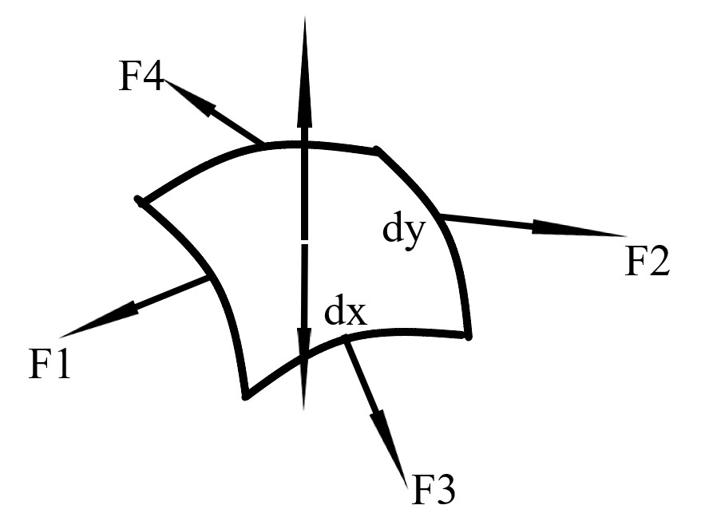

# Physics

## Motion

In an $O-xyz$ coordinate system the position vector $\vec r$ is defined as:

$$
\vec r(t) = x(t)\hat i + y(t)\hat j + z(t)\hat k
$$

Its magnitude is:

$$
r(t) = \sqrt{x^2 + y^2 + z^2}
$$

In polar coordinates, it is usually defined in terms of $r$ and $\theta$.

The displacement vector $\Delta\vec s$ is defined as:

$$
\Delta\vec s = \vec r(t + \Delta t) - \vec r(t)
$$

The average velocity is:

$$
\bar{\vec v} = \frac{\Delta\vec s}{\Delta t}
$$

The instantaneous velocity and acceleration is:

$$
\vec v = \lim_{\Delta t \to 0} \frac{\Delta\vec s}{\Delta t} = \frac{d\vec s}{dt} \\
\vec a = \frac{d\vec v}{dt}
$$

Formulas for constant acceleration motion on a straight line:

$$
\begin{align*}
  v & = v_0 + at \\
  S & = v_0t + \frac 1 2 at^2 \\
  v^2 - v_0^2 & = 2aS \\
  S & = \frac 1 2 (v_0 + v)t
\end{align*}
$$

```{admonition} Strategy: Maximum/minimum values
1. write down the expression for the variable
2. simplify the expression so that it contains one and **only one** **independent** variable
3. mathematically determine the extremum
```

```{admonition} Alternative strategy: Maximum/minimum values
This is best suited for geometric problems (instead of ones that requires tons of calculation).
1. try to determine the position of extremum by *intuition* (sort of obscure)
2. rigorously prove your *intuition*
3. solve the problem
```

General motion in polar coordinates:

$$
\begin{align*}
  \mathbf{r} & = (r\cos\theta, r\sin\theta) \\
  \mathbf{\dot r} & = (
    \dot r\cos\theta - r\sin\theta\dot\theta,
    \dot r\sin\theta + r\cos\theta\dot\theta
  ) = \dot r\hat r + r\dot\theta\hat\theta \\
  \mathbf{\ddot r} & = (\ddot r - r\dot\theta^2)\hat r + (2\dot r\dot\theta + r\ddot\theta)\hat\theta
\end{align*}
$$

### Projectile motion

```{admonition} Model: Falling objects with initial upward velocity
$$
\left\{
\begin{array}{l}
    x = v_0 \cos\theta\,t \\
    y = v_0 \sin\theta\,t - \frac{1}{2}gt^2
\end{array}
\right.
$$

$$
\left\{
\begin{array}{l}
    v_x = v_0\cos\theta \\
    v_y = v_0\sin\theta - gt
\end{array}
\right.
$$
```

```{admonition} Model: Objects falling onto a tilted surface
1. create a coordinate system with the surface as the x(y)-axis
2. identify the initial conditions (velocity, position and acceleration)
3. plug in the equations and solve the problem
```

### Circular and spiral motion

Rigid bodies:

- translational motion
- rotational motion
- combination motion

Angular velocity

$$
\omega = \lim_{\Delta t \to 0} \frac{\Delta \theta}{\Delta t} = \frac{d\theta}{dt}
$$

Angular acceleration

$$
\beta = \frac{d\omega}{dt}
$$


Constant-angular-acceleration rotational motion:

$$
\begin{align*}
  \omega & = \omega_0 + \beta t \\
  \theta & = \omega_0 t + \frac{1}{2}\beta t^2 \\
  \omega^2 - \omega_0^2 & = 2\beta\theta \\
  \theta & = \frac{1}{2}(\omega_0 + \omega)t
\end{align*}
$$

The radius of curvature $\rho$:

$$
\rho = \left|\frac{(1 + y'^2)^{3/2}}{y''}\right|
$$

```{tip}
The acceleration of an object stays the same in different inertial reference frames.
```

````{tip}
Switching inertial reference frames is an excellent way to calculate acceleration.

```{admonition} Example
$$
a = \frac{v^2}{r}
$$

if the center of rotation is stationary in a particular reference frame
```
````

```{admonition} Strategy: Problems involving the angle between two vector quantities
Express the vector (for example, velocity or acceleration) by selecting a pair of basis vectors and then utilizing the [dot product](linear-algebra.md#dot-products-and-lengths):

$$
\cos\theta = \frac{\vec{u}\cdot\vec{v}}{\Vert\vec{u}\Vert\Vert\vec{v}\Vert}
$$

Or more specifically, when $\vec{u}\perp\vec{v}$,

$$
\vec{u}\cdot\vec{v} = 0
$$
```

```{note}
A reference frame can be rotating, in which case it is called a rotating reference frame. A
rotating reference frame is **not** an inertial reference frame.

If a **rotating object** seems to be **stationary** in a rotating reference frame, then it has the same
angular speed as the rotating frame itself, although the direction of $\omega$ (angular velocity)
is reversed.

$$
\omega_{object} = -\omega_{frame}
$$
```

```{tip}
When the relative motion between two objects is involved and one of the objects has a fixed velocity
and/or acceleration, try switching reference frames.
```

## The balance of objects

### The balance of forces

Types of forces:

- gravitational force
- elastic force
- friction
- $\dots$

Springs:

$$
\vec{F} = -k\Delta\vec{x}
$$

where $k$ is the spring constant.

Multiple springs:

- series:
  
  $$
  \frac{1}{k} = \frac{1}{k_1} + \frac{1}{k_2} + \cdots
  $$
- parallel:
  
  $$
  k = k_1 + k_2 + \cdots
  $$

Friction angle:

let $\mu = \tan\varphi$, then

$$
\frac{f_{max}}{N} = \mu_{static} = \tan\varphi
$$

Generally, $f_{static} < f_{max}$. Therefore, 

$$
f_{static} < \mu_{static}N \\
\frac{f_{static}}{N} < \mu_{static} = \tan\varphi
$$

The angle $\alpha$ between the full reaction force $F$ and the normal line cannot be greater than the friction angle $\varphi$

$$
\alpha = \arctan\frac{f_{static}}{N} < \varphi
$$

```{attention}
When the solution to a problem can not be specified as a fixed value, solve for the range of values it lies in.
```

```{admonition} Strategy: Balancing objects influenced by friction
1. use "friction angles"
   
   $$
   \tan\varphi = \mu
   $$
   
2. use geometry and trigonometry to figure out the relationship between the angles
3. substitute $\mu$ back in and get the answer
```

```{admonition} Strategy: The fewer forces, the better
When a large object is in balance, try to find a segment of the object on which the fewest forces act.
In other words, restrict yourself to one or two forces.
```

Young's modulus

$$
E = \frac{\text{stress}}{\text{strain}} = \frac{F/A}{\Delta l/l}
$$

Shear modulus

$$
G = \frac{\text{shear stress}}{\text{shear strain}} = \frac{F/A}{\theta}
$$

### Moment and rotation

$$
\mathbf{M} = \mathbf{r}\times\mathbf{F}
$$

Condition for balance:

$$
\sum\mathbf{M} = \mathbf{0}
$$

Force couples:

$$
\tau = Fd
$$

where $\tau$ is the torque the couple has on the object and $d$ is the distance between the two forces.

---

The synthesis of parallel forces

Let $|AO|$ be the distance between $F$ (the combined force) and $F_1$, and $|BO|$ be the distance between $F$ and $F_2$, then

$$
\frac{|OA|}{|OB|} = \frac{F_2}{F_1}
$$

The magnitude of $F$ depends on whether $F_1$ and $F_2$ are in the same direction or not.

```{admonition} Model: An object with a hole in it
1. pretend that the hole doesn't exist
2. recreate the hole by putting a force in the opposite direction
```

```{tip}
If the direction of a force is unknown, suppose it is in a specific direction and determine whether the system
can stay in balance.

Alternatively, use a coordinate system, write down the force as a general vector $x\hat i + y\hat j + z\hat k$
and apply [linear algebra](linear-algebra.md#linear-algebra)
```

```{admonition} Model: Steelyard balance


(By An Elementary Treatise on Analytic Mechanics: With Numerous Examples By Edward A. (Edward Albert) Bowser, 1893., Public Domain, [Link](https://commons.wikimedia.org/w/index.php?curid=1319572))

Let $|AC| = d$, $|CO| = l_0$, and let $M$ be the moment the gravity of the whole balance has on the pivot $C$

Then if the mass of the weight is $m$, and the mass of the counterweight is $m_0$, we have

$$
M = m_0gl_0
$$

and

$$
mgd + M = m_0g(l_0 + \lambda m)
$$

where $\lambda$ is the ratio of the distance between $O$ and the counterweight and $m$.

Therefore,

$$
d = \lambda m_0
$$

This is the fundamental equation of steelyard balances.
```

```{tip}
A useful trigonometric identity (half angle formula for $\tan$):

$$
\tan\frac{x}{2} = \pm\sqrt{\frac{1 - \cos x}{1 + \cos x}} = \frac{\sin x}{1 + \cos x} = \frac{1 - \cos x}{\sin x} 
$$
```

```{important}
When the number of equations is smaller than the unknowns, the system is statically indeterminate.
Look for hidden details in the text.
```

```{tip}
Focal radii for ellipse

$$
\left(\frac{x}{a}\right)^2 + \left(\frac{y}{b}\right)^2 = 1
$$

where $a \ge b > 0$:

Let $F_1$ denote the left focus and $F_2$ denote the right focus, and let $P(m, n)$ be a point on the ellipse, then

$$
\begin{align*}
  |PF_1| & = a + em \\
  |PF_2| & = a - em
\end{align*}
$$

```

### Liquids in static equilibrium

```{important}
Bernoulli's principle:

$$
p + \frac{1}{2}\rho v^2 + \rho gz = const
$$
```

```{note}
Centrifugal potential energy:

$$
E = -\int_0^xm\omega^2x\,dx = -\frac{1}{2}m\omega^2x^2
$$
```

## Newton's laws

- first: inertia
- second: $F = ma$
- third: action and reaction

```{note}
Newton's laws only apply under macroscopic, low-speed conditions.
```

Acceleration is the bridge between force and motion.

```{admonition} Strategy: How to find acceleration
1. relative motion
   
   $$
   a_{abs} = a_{sys} + a_{rel}
   $$
2. [L'Hospital's Rule](calculus.md#applications-of-differentiation)
   
   $$
   \lim_{t \to 0}\frac{s_1(t)}{s_2(t)} = \lim_{t \to 0}\frac{v_1(t)}{v_2(t)} = \lim_{t \to 0}\frac{a_1(t)}{a_2(t)}
   $$
   
   provided that when $t \to 0$, both $v_1$ and $v_2$ $\to 0$.
3. Touching objects have the same acceleration in the direction of the line perpendicular to the surface
```

### Non-inertial reference frames

Inertial force

$$
\mathbf{F}_{inertial} = -m\mathbf{a}
$$

Rotating reference frames:

$$
F_{centrifugal} = m\omega^2r \\
F_{coriolis} = 2m\mathbf{v}\times\boldsymbol{\omega}
$$

### Planetary motion

Kepler's laws:

- first
- second
- third:
  
  $$
  \frac{T^2}{a^3} = \frac{4\pi^2}{GM}
  $$

Newton's law of gravity:

$$
F = G\frac{m_1m_2}{r^2}
$$

where $G=6.67\times 10^{-11} N\cdot m^2/kg^2$

```{tip}
To avoid using the gravitational constant or the mass of the Sun/Earth, find the ratio between 
the unknown quantitiy and what we already know.
```

```{important}
[Conic sections in polar coordinates](calculus.md#conic-sections-in-polar-forms)
```

## Momentum and angular momentum

Impluse

$$
\mathbf{I} = \mathbf{F}\Delta t
$$

The impulse-momentum theorem:

$$
\mathbf{F}\Delta t = m\mathbf{v}_2 - m\mathbf{v}_1
$$

Variable-mass system:

$$
\mathbf{F}_{ext} + \mathbf{v}_{rel}\frac{dm}{dt} = m\frac{d\mathbf{v}}{dt}
$$

For rockets:

$$
v = u\ln\frac{m_0}{m}
$$

Moment of inertia:

$$
I = \int r^2dm
$$

The parallel axis theorem:

$$
I = I_{cm} + md^2
$$

The perpendicular axis theorem:

If a flat disk is in the $xy$-plane, then

$$
I_z = I_x + I_y
$$

[Common moments of inertia](https://en.wikipedia.org/wiki/List_of_moments_of_inertia):

| Object          | Moment of inertia                       |
| --------------- | --------------------------------------- |
| rod/slab        | $\frac{1}{12}mL^2$ or $\frac{1}{3}mL^2$ |
| cylinder/disk   | $\frac{1}{2}mR^2$                       |
| hoop            | $mR^2$                                  |
| sphere          | $\frac{2}{5}mR^2$                       |
| spherical shell | $\frac{2}{3}mR^2$                       |

Angular momentum:

$$
\mathbf{L} = \mathbf{r}\times\mathbf{p} = mrv\sin\theta
$$

The formula

$$
\mathbf{L} = I\boldsymbol{\omega}
$$

is only true when rotating about an axis of symmetry or a fixed axle.

$$
\boldsymbol{\tau} = \frac{d\mathbf{L}}{dt}
$$

## Energy

### Work and Power

Work

$$
W = \mathbf{F}\cdot\mathbf{s} = Fs\cos\theta
$$

Power

$$
P = \frac{W}{t} = \mathbf{F}\cdot\mathbf{v} = Fv\cos\theta
$$

```{important}
Energy and work are frame-dependent!
```

### Work and Energy

The work-kinetic energy theorem:

$$
W_{net} = \Delta E_{k}
$$

Conservation of mechanical energy:

$$
K_f + U_f = K_i + U_i
$$

where $K$ and $U$ are kinetic energy and potential energy, respectively.

### Collisions

During a perfectly **inelastic** collision, the two objects move together and only momentum is conserved.

$$
m_1\mathbf{v}_1 + m_2\mathbf{v}_2 = m\mathbf{v}
$$

---

During a perfectly **elastic** collision, both momentum and energy are conserved:

$$
\begin{align*}
  m_1\mathbf{v}_1 + m_2\mathbf{v}_2 & = m_1\mathbf{v}_1' + m_2\mathbf{v}_2' \\
  \frac{1}{2}m_1v_1^2 + \frac{1}{2}m_2v_2^2 & = \frac{1}{2}m_1v_1'^2 + \frac{1}{2}m_2v_2'^2
\end{align*}
$$

---

Coefficient of restitution
: the ratio of the relative speed after and before the collision

$$
e = \frac{|v_1' - v_2'|}{|v_1 - v_2|}
$$

- For a perfectly **elastic** collision, $e = 1$.
- For a perfectly **inelastic** collision, $e = 0$.
- Otherwise, $0 < e < 1$.

### Satellite orbits and energies

```{admonition} Strategy
1. [Kepler's second law](#planetary-motion) or [conservation of angular momentum](#momentum-and-angular-momentum)
   
   $$
   rv\sin\alpha = r'v'\sin\beta
   $$
   
   where $\alpha$ and $\beta$ are the angle between $\mathbf{r}$ and $\mathbf{v}$.
2. Conservation of energy
   
   $$
   E = E_k + E_{grav} = E_k' + E_{grav}'
   $$
   
   | Orbit type | $E$               |
   | ---------- | ----------------- |
   | Ellipse    | $-\frac{GMm}{2a}$ |
   | Parabola   | $0$               |
   | Hyperbola  | $\frac{GMm}{2a}$  |
3. [Kepler's third law](#planetary-motion)
4. [Orbits in polar coordinates](calculus.md#conic-sections-in-polar-forms)
```

```{tip}
Useful trigonometric identities:

$$
\begin{align*}
\sin a \sin b & = \frac{\cos(a - b) - \cos(a + b)}{2} \\
\cos a \cos b & = \frac{\cos(a - b) + \cos(a + b)}{2} \\
\sin a \cos b & = \frac{\sin(a + b) + \sin(a - b)}{2} \\
\cos a \sin b & = \frac{\sin(a + b) - \sin(a - b)}{2}
\end{align*}
$$

Reverse identities:

$$
\begin{align*}
\sin a + \sin b & = 2 \sin \left(\frac{a + b}{2} \right) \cos \left(\frac{a - b}{2} \right) \\
\sin a - \sin b & = 2 \cos \left(\frac{a + b}{2} \right) \sin \left(\frac{a - b}{2} \right) \\
\cos a + \cos b & = 2 \cos \left(\frac{a + b}{2} \right) \cos \left(\frac{a - b}{2} \right) \\
\cos a - \cos b & = -2 \sin \left(\frac{a + b}{2} \right) \sin \left(\frac{a - b}{2} \right)
\end{align*}
$$
```

```{caution}
Be careful with the ranges of the inverse trigonometric functions!

| Function    | Range                             |
| ----------- | --------------------------------- |
| $\arcsin x$ | $[-\frac{\pi}{2}, \frac{\pi}{2}]$ |
| $\arccos x$ | $[0, \pi]$                        |
| $\arctan x$ | $(-\frac{\pi}{2}, \frac{\pi}{2})$ |
```

## Oscillations and waves

### Simple harmonic motion

Position, speed and acceleration:

$$
\begin{align*}
  x & = A\cos(\omega t + \varphi_0) \\
  v & = -\omega A\sin(\omega t + \varphi_0) \\
  a & = -\omega^2 A\cos(\omega t + \varphi_0) \\
\end{align*}
$$

For a second-order differential equation in the form

$$
\ddot{x} = -\omega^2 x
$$

the solution is simply SHM with angular frequency $\omega$.

Period:

$$
T = 2\pi\sqrt{\frac{1}{\omega}}
$$

For springs and simple pendulums,

$$
\begin{align*}
  T_{spring} & = 2\pi\sqrt{\frac{m}{k}} \\
  T_{pendulum} & = 2\pi\sqrt{\frac{l}{g}} \\
  E_{string} & = \frac{1}{2}kA^2 \\
\end{align*}
$$

```{admonition} Strategy: General SHM
In more general conditions other than springs and pendulums, try to determine the system's **equivalent**
"mass" and "spring coefficient".

1. write down the system's potential energy $V(q)$ where $q$ is a custom variable
2. The equilibrium points are those such that $V'(q) = 0$.
3. The equivalent "spring coefficient" $k^*$ is given by $V''(q)$
4. determine the equivalent "mass" by writing down the kinetic energy:
   
   $$
   T(\dot{q}) = \frac{1}{2}m^*\dot{q}^2
   $$
   
5. plug everything into the spring equation above
```

### Waves

A sinusoidal wave

$$
y(x, t) = A\cos(\omega t - kx + \varphi_0)
$$

has the following properties:

| Name              | Value                                   |
| ----------------- | --------------------------------------- |
| amplitude         | $A$                                     |
| frequency         | $f$                                     |
| wavelength        | $\lambda$                               |
| initial phase     | $\varphi_0$                             |
| angular frequency | $\omega = 2\pi f = \frac{2\pi}{T}$      |
| period            | $T = \frac{1}{f} = \frac{2\pi}{\omega}$ |
| wave number       | $k = \frac{2\pi}{\lambda}$              |
| wave speed        | $v = \lambda f = \frac{\lambda}{T}$     |
| phase             | $\varphi = \varphi_0 + \omega t$        |

```{note}
It is perfectly fine (although highly discouraged, see the note below) to replace the cosine function
with a sine function, however do keep in mind the differences between sine and cosine, including the
ranges of their inverse functions (see above).
```

In the wave equation above, if $x$ is fixed at $x_0$, then $y$ turns into a function of $t$.
This function represents the oscillation at a fixed point as time goes on.

$$
y(t) = A\cos(\omega t - kx_0 + \varphi_0)
$$

There is a subtle but extremely important detail in the equation above, namely the fact that
the actual phase is represented by $\varphi_0 + \omega t$, while the term $-kx$ determines the
displacement at different x-coordinates.

As a result, if the wave travels in the opposite direction, the signs of both $\varphi_0$ and $\omega t$
need to be inverted. However, as the cosine function is an even function, it is equivalent with replacing
$-kx$ with $kx$. (If a sine function is used instead, make sure that an additional minus sign is added.)

```{tip}
For both sine and cosine functions, if $kx$ and $\omega t$ are opposite in sign, the wave travels to the
right. If they are the same in sign, the wave travels to the left.
```

```{important}
In simple problems concerning waves (especially the phases of a travelling wave), it is highly recommended
to stick to the cosine expression above. The reason is that at a fixed point, it is not at all intuitive
to have a $-\omega t$ term, as if the "phase" is "decreasing", like this:

$$
y(t) = A\sin(kx_0 - \omega t + \varphi_0)
$$

(even though I have seen many books and websites recommend this approach)

Therefore, in more complex problems, it is usually much more preferable to use complex exponentials so as
to avoid the tricky phase problem.
```

### Waves as complex exponentials

$$
\widetilde{U}(x, t) = \widetilde{A}e^{i(\omega t \mp kx)}
$$

where

$$
\widetilde{A} = Ae^{i\varphi_0}
$$

is the complex amplitude.

The complex conjugate of the wave function is

$$
\widetilde{U}^*(x, t) = \widetilde{A}^*e^{-i(\omega t \mp kx)}
$$

To transform the complex wave function back into a trigonometric one, simply apply this formula:

$$
\begin{align*}
  \Re(\widetilde{U}) & = \frac{\widetilde{U} + \widetilde{U}^*}{2} \\
                     & = A\cos(\varphi_0 + \omega t \mp kx) \\
  \Im(\widetilde{U}) & = \frac{\widetilde{U} - \widetilde{U}^*}{2i} \\
                     & = A\sin(\varphi_0 + \omega t \mp kx) \\
\end{align*}
$$

```{warning}
In the second equation, as the wave travels to the right, there is a $-kx$ term in the $\sin$,
which is an odd function. As a result, the phase of the wave is also "inverted".

Therefore, under most circumstances, it **definitely** should **NOT** be used.
```

According to a [rule](calculus.md#complex-numbers) concerning complex conjugates, we have

$$
\widetilde{U}\widetilde{U}^* = |U|^2 = A^2
$$

### Standing waves

When two waves have the same amplitude, frequency and wavelength and at the same time travels in the
opposite direction, they interfere with each other and produce a standing wave.

$$
\begin{align*}
  \widetilde{U}_1 & = Ae^{i(\omega t - kx)} \\
  \widetilde{U}_2 & = Ae^{i(\omega t + kx)} \\
  \widetilde{U} & = \widetilde{U}_1 + \widetilde{U}_2 \\
                & = Ae^{i\omega t}(e^{-ikx} + e^{ikx}) \\
  \Re(\widetilde{U}) & = 2A\cos\omega t\cos kx \\
\end{align*}
$$

The amplitude function

$$
A(x) = \left|2A\cos kx\right|
$$

```{tip}
Euler's formula:

$$
-e^{ix} = e^{i\pi}e^{ix} = e^{i(\pi + x)}
$$
```

For tubes/strings, there are three distinct cases

| Type          | Endpoint | Frequency                           |
| ------------- | -------- | ----------------------------------- |
| closed-closed | node     | $f = n\frac{v}{2L}$                 |
| open-open     | antinode | $f = n\frac{v}{2L}$                 |
| open-closed   | mixed    | $f = (n - \frac{1}{2})\frac{v}{2L}$ |

### The Doppler effect

In the table below, the velocities of the source, the observer and the wave in the medium are $u$, $v$ and $c$,
respectively.

| Source     | Observer   | Frequency                       |
| ---------- | ---------- | ------------------------------- |
| stationary | stationary | $f' = f$                        |
| stationary | moving     | $f' = \frac{c \pm v}{c}f$       |
| moving     | stationary | $f' = \frac{c}{c \mp u}f$       |
| moving     | moving     | $f' = \frac{c \pm v}{c \mp u}f$ |

```{note}
When both the source and the observer are moving, it is not recommended to use the equation above
as it may yield incorrect answers when the velocities are not on the same line.

Instead, trace the motion of a single wave crest (or trough) and use the definition of the frequency.
```

```{important}
The velocity of a wave ($v = \lambda f$) is the velocity relative to the medium!
```

## Thermodynamics

### The ideal gas law

$$
pV = \nu RT
$$

Avogrado's number

$$
N_A = 6.02 \times 10^{23} \text{mol}^{-1}
$$

Boltzmann's constant

$$
k_B = \frac{R}{N_A} = 1.38 \times 10^{-23} J/K
$$

Let $n$ be the particle density $N/V$, and we get

$$
p = nk_BT
$$

By analyzing the motion of each molecule and adding them all together, we get

$$
p = \frac{2}{3}n\overline{E_k}
$$

Combining the last two equations together, here is another formula for $\overline{E_k}$:

$$
\overline{E_k} = \frac{3}{2}k_BT
$$

```{tip}
The binomial approximation:

$$
(1 + x)^n \approx 1 + nx
$$
```

```{tip}
$$
\nu\propto V
$$
```

### The first law of thermodynamics

The change in internal energy equals the sum of the heat transferred from the environment and the
work done by the environment.

$$
\Delta U = Q + W
$$

```{caution}
Make sure the signs before $Q$ and $W$ are correct! They must correspond to the heat **FROM** the environment
and the work **BY** the environment!
```

The work done on the system can always be calculated with integration:

$$
W = \int\mathbf{F}\cdot d\mathbf{r} = \int p\,dV
$$

```{caution}
When calculating the work, **never ever** forget to take the atmospheric pressure $p_0$ into account.
```

### Ideal-gas processes

Isochoric (constant-volume)

$$
\begin{align*}
  \because W & = 0 \\
  \therefore \Delta U & = Q \\
  \therefore \frac{i}{2}\nu RT & = \nu C_V \Delta T \\
  \therefore C_V & = \frac{i}{2}R
\end{align*}
$$

Isobaric (constant-pressure)

$$
\begin{align*}
  \because \Delta U & = Q + W \\
  \therefore \frac{i}{2}\nu RT & = \nu C_P \Delta t - p \Delta V \\
                               & = \nu C_P \Delta t - \nu R \Delta t \\
  \therefore C_P & = C_V + R
\end{align*}
$$

Isothermal (constant-temperature)

$$
\begin{align*}
  \because \Delta U & = 0 \\
  \therefore Q & = -W \\
               & = \int_{V_1}^{V_2} p\,dV \\
               & = \int_{V_1}^{V_2} \frac{\nu RT}{V}\,dV \\
               & = \nu RT\ln\frac{V_2}{V_1} \\
               & = \nu RT\ln\frac{p_1}{p_2}
\end{align*}
$$

Adiabatic

$$
\begin{align*}
  \because Q & = 0 \\
  \therefore W & = \Delta U \\
\end{align*}
$$

If

$$
\gamma = \frac{C_P}{C_V}
$$

then we have

$$
p_iV_i^\gamma = p_fV_f^\gamma = constant
$$

```{admonition} Strategy: Multistep processes
If a process involves more than two states, such as this one:

$$
A \to B \to C
$$

then directly analyzing $A \to B$ and $B \to C$ may not be plausible.

Instead, try $A \to C$.
```

### Surface phenomena

Surface tension is caused by the attractive forces between molecules of a liquid.

$$
f = \sigma L
$$

Alternatively, use the work-area formula:

$$
W = \sigma\Delta A
$$

Wetting and capillary action depends on the cohesion between liquid molecules and the adhesion among
liquid and solid molecules.

Let $\theta$ be the contact angle, and $r$ be the radius of the tube, then

$$
F_{cap} = f\cos\theta = 2\sigma\pi r\cos\theta = \rho\pi r^2gh
$$

Therefore

$$
h = \frac{2\sigma\cos\theta}{\rho gr}
$$

```{admonition} Laplace pressure
$$
\Delta p = \sigma\left(\frac{1}{\rho_x} + \frac{1}{\rho_y}\right)
$$

where $\rho_x$ and $\rho_y$ are the radii of curvature in two perpendicular directions parallel
to the surface.

Proof:



$$
\begin{align*}
  \because \Delta p\,dS & = 2F_1\sin\left(\frac{1}{2}\frac{dx}{\rho_x}\right)
                          + 2F_3\sin\left(\frac{1}{2}\frac{dy}{\rho_y}\right) \\
                        & \approx F_1\frac{dx}{\rho_x} + F_3\frac{dy}{\rho_y} \\
                        & = \sigma\frac{dx\,dy}{\rho_x} + \sigma\frac{dx\,dy}{\rho_y} \\
                        & = \sigma dS \left(\frac{1}{\rho_x} + \frac{1}{\rho_y}\right) \\
  \therefore \Delta p & = \sigma\left(\frac{1}{\rho_x} + \frac{1}{\rho_y}\right)
\end{align*}
$$
```

```{important}
Laplace pressure is **very** useful, especially when one of the radii (or both of them) is $\infty$.
```

### Heat transfer and thermal expansion

Conduction

$$
Q = K\frac{\Delta T}{l}S\Delta t
$$

Radiation (black body)

$$
J = \sigma T^4
$$

Radiation

$$
J = \varepsilon\sigma T^4
$$

```{note}
Concerning thermal expansion, I have seen various different expressions contradicting one another.

Therefore, this topic is currently omitted.
```

### Maxwell-Boltzmann distribution

$$
f(v) = 4\pi\left(\frac{m}{2\pi kT}\right)^{\frac{3}{2}}e^{-\frac{mv^2}{2kT}}v^2
$$

There are three distinct speeds related to this distribution

The average speed

$$
v_{avg} = \sqrt{\frac{8kT}{\pi m}} = \sqrt{\frac{8RT}{\pi M}}
$$

The root-mean-square speed

$$
v_{rms} = \sqrt{\frac{3kT}{m}} = \sqrt{\frac{3RT}{M}}
$$

The most probable speed

$$
v_p = \sqrt{\frac{2kT}{m}} = \sqrt{\frac{2RT}{M}}
$$

### The second law of thermodynamics

- The entropy of an isolated system never decreases.
- Heat cannot be spontaneously transferred from a cold reservoir to a hot reservoir.
- There are no perfect heat engines or perfect refrigerators. 
- $\dots$

Entropy

```{note}
Unfortunately, till now, I haven't fully grasped the concept of entropy. I'll fill in this section
after I become more familiar with it.
```

## Electrostatics

### The electric field

Coulomb's law

$$
F = \frac{1}{4\pi\varepsilon_0}\frac{|q_1||q_2|}{r^2}
$$

The electric field of a particle

$$
\mathbf{E} = \frac{1}{4\pi\varepsilon_0}\frac{q}{r^2}\mathbf{\hat{r}}
$$

```{important}
Electric fields follow the rule of superposition.
```

Gauss's Law

$$
\Phi_e = \oint\mathbf{E}\cdot d\mathbf{A} = \frac{Q_{in}}{\varepsilon_0}
$$

```{note}
- From now on, unless noted otherwise, every charge distribution is **uniform**.
- As a convention $r$ is the distance to the charge distribution and $R$ is the geometric radius.
```

```{tip}
The electric field of various charge distributions

| Distribution              | $E$-field                                    |
| ------------------------- | -------------------------------------------- |
| point charge              | $\frac{1}{4\pi\varepsilon_0}\frac{q}{r^2}$   |
| spherical shell (inside)  | $0$                                          |
| spherical shell (outside) | $\frac{1}{4\pi\varepsilon_0}\frac{q}{r^2}$   |
| infinitely long wire      | $\frac{1}{4\pi\varepsilon_0}\frac{2\eta}{r}$ |
| infinitely large plane    | $\frac{\sigma}{2\varepsilon_0}$              |
```

### The electric potential

$$
\varphi = \frac{U_{elec}}{q}
$$

As a result, the potential difference is equal to the work done divided by the charge:

$$
\Delta\varphi_{AB} = \frac{W_{AB}}{q}
$$

The electric potential of a point charge

$$
\begin{align*}
  \because U_{elec} & = -\int_\infty^r \frac{1}{4\pi\varepsilon_0}\frac{Qq}{r^2}\,dR \\
             & = \frac{1}{4\pi\varepsilon_0}\frac{Qq}{r} \\
  \therefore \varphi & = \frac{1}{4\pi\varepsilon_0}\frac{Q}{r}
\end{align*}
$$

```{tip}
Common electric potentials:

| Distribution              | Potential $\varphi$                      |
| ------------------------- | ---------------------------------------- |
| point charge              | $\frac{1}{4\pi\varepsilon_0}\frac{q}{r}$ |
| spherical shell (inside)  | $\frac{1}{4\pi\varepsilon_0}\frac{q}{R}$ |
| spherical shell (outside) | $\frac{1}{4\pi\varepsilon_0}\frac{q}{r}$ |
```

```{important}
Electric potentials follow the rule of superposition!
```

```{admonition} Strategy: Calculating electric potential
1. basic tools: the electric potential of a point charge and superposition (see above)
2. determine the symmetry of the system
3. transform the system according to the symmetry in a way that does not change the (average) potential.
4. common transformations:
   - moving the charge around along a surface
   - using the definition of the potential, i.e. $\text{energy}/\text{charge}$ to swap the potential producer and receiver
   - utilizing the fact that the potential inside a uniformly charged spherical shell is constant
   - making copies of the original charge to get a higher degree of symmetry
   - $\dots$ (other excellent transformations you *might* think of)
```

```{note}
Calculating the electric **field** is essentially the same as calculating the electric **potential**.
As a result, most of the strategies above still apply if the electric **field** is desired instead.
```

```{tip}
1. Whenever possible, try to use "accumulated" quantities such as [momentum](#momentum-and-angular-momentum)
   or [energy](#energy), including electric potential energy. This can sometimes simplify the calculations a lot.
2. When the whole process is difficult to reason about, try to analyze a short segment such as $dt$ or $ds$.
```

```{attention}
Coulumb's law only applies to **point** charges!
```

### Electric dipoles

The behavior of electric dipoles is characterized by its moment

$$
\mathbf{p} = q\mathbf{d}
$$

The direction of $\mathbf{p}$ points from the negative charge to the positive charge.

The electric potential of an electric dipole is given by

$$
\varphi \approx \frac{1}{4\pi\varepsilon_0}\frac{\mathbf{p}\cdot\mathbf{\hat{R}}}{R^2}
$$

where $\mathbf{R}$ represents the vector from the center of the dipole to the point at which the
potential is evaluated.

Taking the gradient of the potential, we now have the electric field

$$
\begin{align*}
  E_\perp & \approx \frac{1}{4\pi\varepsilon_0}\frac{p}{r^3} \\
  E_\parallel & \approx \frac{1}{4\pi\varepsilon_0}\frac{2p}{r^3}
\end{align*}
$$

```{note}
The general formula for the electric field is omitted (for now) as it can be easily derived by
splitting the dipole into its parallel and perpendicular components, or by taking the gradient.
```

```{important}
The formulas above only work when $R \gg d$!
```

### Capacitors

$$
C = \frac{Q}{U}
$$

Parallel-plate capacitors

$$
C = \frac{Q}{Ed} = \frac{\sigma A}{\frac{\sigma}{\varepsilon_0}d} = \frac{\varepsilon_0 A}{d}
$$

```{note}
The capacitance of other capacitors can be easily derived with the definition of capacitance.
```

The capacitance of an isolated spherical conductor

$$
C = \frac{Q}{\frac{1}{4\pi\varepsilon_0}\frac{Q}{R}} = 4\pi\varepsilon_0 R
$$

Parallel capacitors

$$
C = \sum_{i=1}^n C_i
$$

Series capacitors

$$
\frac{1}{C} = \sum_{i=1}^n\frac{1}{C_i}
$$

### The energy of an electric field

The energy of a charged object (this does **NOT** work for particles)

$$
W = \frac{1}{2}QU = \frac{Q^2}{2C} = \frac{1}{2}CU^2
$$

The energy density of any electric field

$$
\omega = \frac{1}{2}\varepsilon_0E^2
$$

### Polarization

Conductors in electrostatic equilibrium will have inducted charges which cancel the external electric
field. Inside conductors, there is no net charge or electric field.

For dielectrics, we define the relative permittivity

$$
\varepsilon_r = \frac{E_0}{E}
$$

where $E$ is the electric field in vacuum.

Every equation concerning static electric fields also work in dielectrics. However, the vacuum permittivity
constant $\varepsilon_0$ must be replaced with $\varepsilon_r\varepsilon_0$.

```{important}
When to use $\varepsilon_r$ and when not to use $\varepsilon_r$:

- When the target charge distribution creates induced charges on the dielectric, use $\varepsilon_r$.
- When it does not, or when the induced charge has already been considered in another equation,
don't use $\varepsilon_r$.
```

```{admonition} Method of image charges
The method of image charges is an especially important method for solving polarization problems.
Basically it utilizes the uniqueness theorem to replace the complex induced charge distribution
with one or more image charges.

The simplest case is simply a charge sitting in front of a conducting wall. In this case the image
charge is located on the other side and the distances from two charges to the wall are the same.

The following is a slightly more complex but especially useful example.


The greem charge inside the spherical shell induces an image charge outside (the charge in red) and
vice versa. The radius of the circle is the geometric mean of the distances between each of the two
charges and the center. In other words, if $d_{out}$ is the distance between the red charge and the center,
then

$$
d_{in} = \frac{R^2}{d_{out}}
$$

The ratio of the two charges is

$$
\frac{q_{in}}{q_{out}} = \frac{d_{in}}{R} = \frac{R}{d_{out}}
$$

Sometimes, to keep the shell neutral with no net charge, another charge is added at the center of the sphere.
```

The electric displacement field

$$
\mathbf{D} = \varepsilon_0\mathbf{E} + \mathbf{P} \\
\oint_A \mathbf{D}\cdot d\mathbf{A} = q_{free}
$$

```{note}
This section needs expansion.
```

## Circuits

### Ohm's law

The current $I$ is defined to be

$$
I = \frac{dQ}{dt} = nAve
$$

Resistance is related to resistivity, length and cross-section area.

$$
R = \rho\frac{L}{A}
$$

Ohm's Law

$$
I = \frac{U}{R}
$$

Or alternatively, in terms of current density $J$ and conductivity $\sigma$ (SI unit siemens per meter $S/m$)

$$
J = \sigma E
$$

The work done by a current

$$
W = UIt
$$

The heat produced by a current

$$
Q = I^2Rt
$$

### Transformations of circuits

- folding: combine two identical parts of the circuit together by dividing their resistance in half
- splitting/merging: split or merge points with the same electric potential
- recursion: If the resistance of the whole **infinite** circuit is defined to be $R$, then adding
  another segment does not change its resistance.
- $Y-\Delta$ transform
  
  
  
  (Xyzzy_n, [CC BY-SA 3.0](https://creativecommons.org/licenses/by-sa/3.0), via Wikimedia Commons)
  
  $$
  \begin{align*}
  R_a & = \frac{R_1 R_2 + R_2 R_3 + R_3 R_1}{R_1} \\
  R_b & = \frac{R_1 R_2 + R_2 R_3 + R_3 R_1}{R_2} \\
  R_c & = \frac{R_1 R_2 + R_2 R_3 + R_3 R_1}{R_3}
  \end{align*}
  $$
  
  $$
  \begin{align*}
  R_1 & = \frac{R_b R_c}{R_a + R_b + R_c} \\
  R_2 & = \frac{R_a R_c}{R_a + R_b + R_c} \\
  R_3 & = \frac{R_a R_b}{R_a + R_b + R_c}
  \end{align*}
  $$

### Kirchhoff's circuit laws

TODO

### Applications of circuits

TODO

### Properties of conductors

TODO

### Semiconductors

TODO

## Magnetostatics

### The magnetic field

The Biot-Savart law

$$
\mathbf{B}_{point\ charge} = \frac{\mu_0}{4\pi}\frac{q\mathbf{v}\times\mathbf{\hat{r}}}{r^2}
$$

or alternatively, in terms of current segments

$$
d\mathbf{B}_{current} = \frac{\mu_0}{4\pi}\frac{Id\mathbf{s}\times\mathbf{\hat{r}}}{r^2}
$$

Ampère's law

$$
\oint \mathbf{B}\cdot d\mathbf{s} = \mu_0I_{through}
$$

```{tip}
Common magnetic fields

| Object                                | $B$-field                |
| ------------------------------------- | ------------------------ |
| infinitely long wire                  | $\frac{\mu_0I}{2\pi R}$  |
| current loop (center)                 | $\frac{\mu_0I}{2R}$      |
| current loop ($r \gg R$, on the axis) | $\frac{\mu_0R^2I}{2r^3}$ |
| solenoid                              | $\frac{\mu_0NI}{l}$      |
```

The magnetic force

$$
\begin{align*}
  F & = q\mathbf{v}\times\mathbf{B} \\
  F & = I\mathbf{\ell}\times\mathbf{B}
\end{align*}
$$

```{admonition} Model: Cyclotron motion
$$
R = \frac{mv^2}{F_m} = \frac{mv^2}{qvB} = \frac{mv}{qB}
$$
```

The energy of the magnetic field

$$
\omega_m = \frac{B^2}{2\mu_0}
$$

```{important}
Regarding the energy of magnetic fields, the $B$-field, unlike the $E$-field cannot do work on
moving charged particles.

However, when the magnetic field is **changing**, it [induces](#electromagnetic-induction) an electric
field, which **can** do work.
```

### Applications of electromagnetic fields

The Hall effect

Suppose a wire with a rectangular cross section is put under a magnetic field $B$, and $w$ and $t$
are the length of the sides perpendicular and parallel to the magnetic field, respectively.

Then

$$
E = vB = \frac{IB}{nwte}
$$

Therefore

$$
U = Ew = \frac{IB}{tne}
$$

```{tip}
Dealing with a charged particle in a magnetic field on which external forces are applied:

The **key** is that as the particle gains a velocity under the influence of the external force, the
magnetic field $B$ also has a force on it. Thus the path of the particle is a curve.

To solve such a problem, split the velocity into its two components, $v_x$ and $v_y$.

Therefore

$$
\begin{align*}
  m\dot{v}_x & = qv_yB \\
  \int dv_x & = \int \frac{qB}{m}v_y\,dt \\
  v_x & = \frac{qBy}{m}
\end{align*}
$$
```

## Electromagnetic induction

Faraday's law

$$
\mathcal{E} = -\frac{d\Phi}{dt}
$$

For a conducting rod, this is also valid:

$$
\mathcal{E} = vlB
$$
